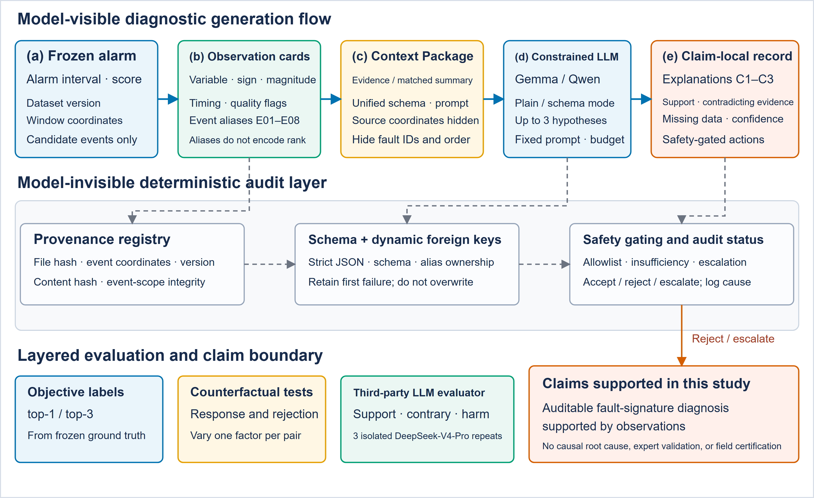
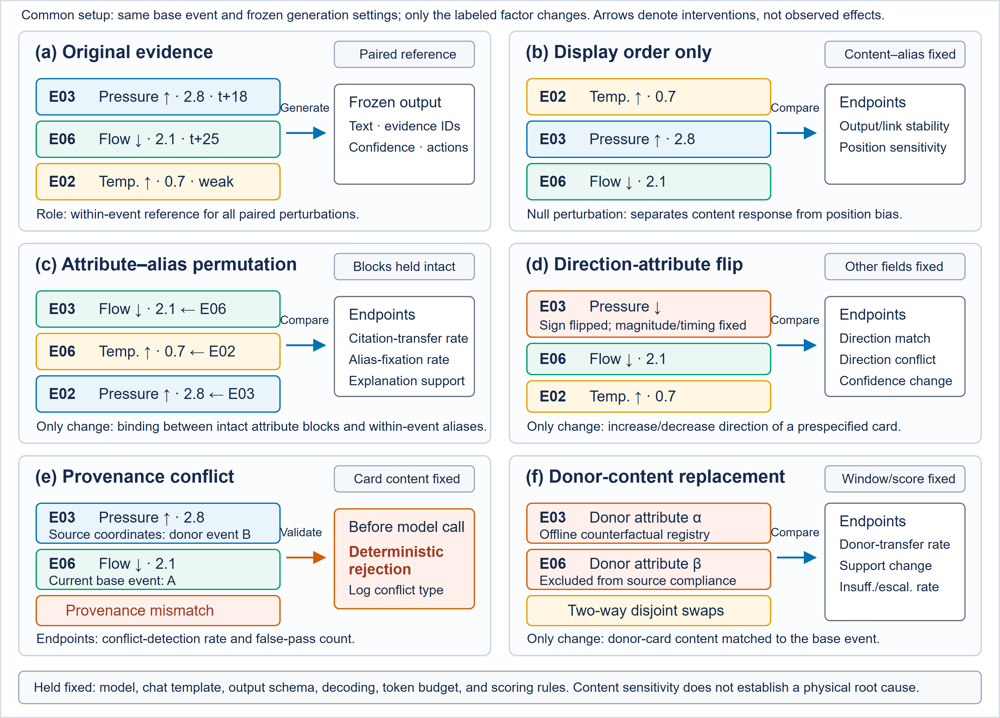
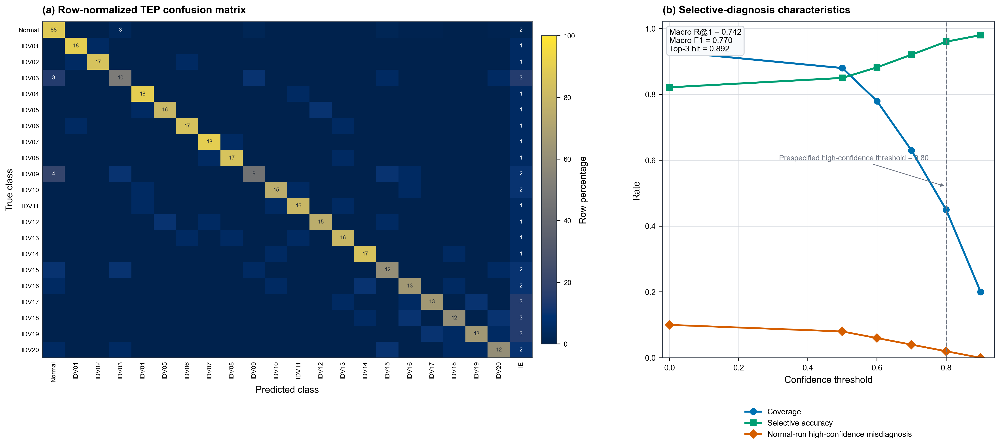
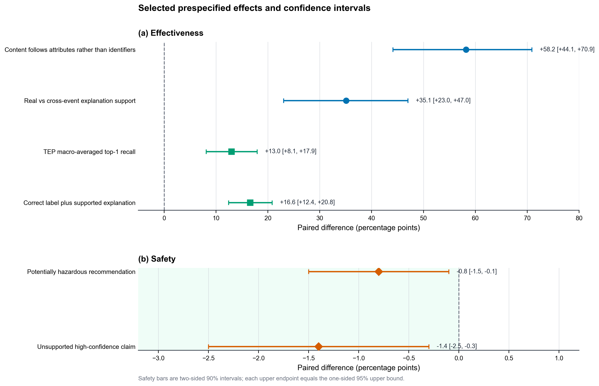

# 面向工业报警后诊断的可审计证据绑定

本仓库是论文 **Auditable Evidence Binding for Large Language Model-Assisted
Post-Alarm Diagnosis in Industrial Sensor Time Series** 的可执行参考实现。

它解决的不是异常检测问题，而是报警发生之后的诊断交接问题：

> 如何让大语言模型生成的诊断结论能够追溯到当前报警事件中的传感器证据，并由模型外部的确定性程序完成校验、拒绝和升级？

仓库实现了论文最终方案的单事件运行链路：

```text
冻结报警事件
  -> 候选观测卡提取
  -> 事件内证据别名与隐藏溯源注册表
  -> 事件级动态诊断 Schema
  -> 诊断后端生成候选解释
  -> 严格解析、Schema、溯源和安全审计
  -> 接受、拒绝或升级至人工复核
```

系统输出的是可拒绝、可追溯的人工复核记录，不是物理根因证明，也不能直接
连接工业控制系统执行操作。

## 论文主要内容

### 1. 研究问题

工业异常检测器能够识别异常时间区间，但下游 LLM 即使生成了格式正确、语言
流畅的说明，仍可能存在以下问题：

- 引用了不属于当前报警事件的观测；
- 只复制证据编号，没有真正响应证据内容；
- 忽略矛盾证据或缺失信息；
- 输出不符合规定的数据结构；
- 给出与证据强度不相称的置信度；
- 建议联锁旁路、修改设定值或设备切换等高风险动作。

因此，论文将结构有效性、溯源完整性、内容响应性、语义支持和操作安全拆分为
不同的验证层。后续层级的成功不能修复前面层级的失败。

### 2. 核心方法



*图 1，来自论文。模型只接收事件内候选观测；模型不可见的确定性层负责溯源、
动态外键、Schema 和安全门控。*

论文提出 auditable context evidence package，即可审计上下文证据包。每个报警
事件按以下方式处理：

1. 冻结报警区间、检测器版本、参考数据版本和输入身份；
2. 根据全局偏差、局部报警前偏差、峰值、趋势和质量标记构建候选观测卡；
3. 为当前事件的候选观测随机分配 `E01` 至 `E08` 等局部别名；
4. 将数据版本、源哈希、时间坐标、检测器版本、提取器版本、参考版本和内容
   哈希保存在模型不可见的注册表中；
5. 要求诊断记录显式包含支持证据、矛盾证据、缺失信息、置信度和允许动作；
6. 在模型外部执行严格 JSON 解析、Draft 2020-12 Schema、动态外键、事件归属、
   内容哈希和安全策略校验；
7. 将结果标记为 `accepted`、`rejected` 或 `escalated`，再交给人工复核。

论文允许最多三个候选解释。证据不足不是运行失败，而是必须被显式记录并进入
`COLLECT_MORE_DATA` 或 `ESCALATE_TO_HUMAN`。

### 3. 实验设计

论文使用两个公开工业时间序列基准：

| 数据集 | 独立评估单元 | 论文中的作用 |
| --- | --- | --- |
| HAI 21.03 | 攻击或误报簇 | 结构可靠性、溯源、证据编号捷径和反事实测试 |
| Tennessee Eastman Process | 独立仿真运行 | 已知故障语义、选择性诊断、解释支持、校准和安全 |

主要反事实实验包括证据顺序置换、属性与编号置换、方向反转、跨事件内容替换及
溯源冲突。实验只改变一个标记因素，其余事件和生成条件保持一致。



*图 2，来自论文。配对设计用于区分模型是在使用传感器内容，还是只在复制编号
或固定位置。*

### 4. 论文最终结论

论文报告的主要结果包括：

| 论文结论 | 完整证据方案 | 对照方案 | 报告差异 |
| --- | ---: | ---: | ---: |
| HAI 首次严格 Schema 合规率 | 0.978 | 0.701 | +27.7 个百分点 |
| TEP 宏平均 Top-1 召回率 | 0.742 | 0.612 | +13.0 个百分点 |
| 正确标签且解释获得支持的比例 | 0.714 | 0.548 | +16.6 个百分点 |
| 属性与编号置换后，引用跟随内容而非旧编号 | - | - | +58.2 个百分点 |
| 跨事件替换后，选择证据不足或人工升级 | - | - | +29.1 个百分点 |

这些结果支持以下结论：

- 结构正确不等于证据正确；
- 合法证据编号覆盖率不能证明模型真正使用了证据；
- 事件内证据绑定和反事实测试能够检验内容响应性；
- LLM 适合提出可审阅的故障特征假设；
- Schema、溯源、动态外键、哈希、安全动作和最终状态必须由确定性程序负责；
- 系统应作为监测与人工复核之间的可拒绝接口，而不是自主控制器。



*图 3，来自论文。TEP 故障级混淆矩阵与选择性诊断结果。*



*图 4，来自论文。论文报告的部分有效性和安全性效应及置信区间。*

## 本仓库直接执行什么

本仓库直接执行论文最终方案中的单事件诊断与审计路径，而不是仅提供一份结果
绘图脚本。

使用示例事件运行后，程序会依次完成：

1. 验证冻结事件的数据契约；
2. 计算并排序候选观测卡；
3. 生成与候选排名无关的事件内别名；
4. 分离模型可见上下文和模型不可见溯源注册表；
5. 根据当前事件的别名集合编译动态 JSON Schema；
6. 调用选定的诊断后端；
7. 执行严格解析、Schema、溯源和安全审计；
8. 写入诊断记录、审计记录、运行日志和内容哈希清单。

离线 `rules` 后端会得到 `accepted` 示例结果；不调用任何模型的 `safe` 后端会
生成符合契约的证据不足记录，并得到 `escalated` 状态。

## 论文结论与代码的直接对应关系

下表说明哪些代码直接承担论文最终结论中的责任。这里的“直接对应”是指执行
相同的方法责任，不表示单次示例运行能够重新估计论文的汇总统计量。

| 论文中的方法或结论 | 直接相关代码 | 可执行责任 |
| --- | --- | --- |
| 报警事件必须先被冻结和验证 | [`domain.py`](src/auditable_evidence_binding/domain.py) | 校验报警区间、有限数值、信号长度、唯一名称、检测器和数据源信息 |
| 候选观测质量决定诊断上限 | [`evidence.py`](src/auditable_evidence_binding/evidence.py) | 计算全局和局部稳健偏差、峰值、趋势、质量标记及确定性 Top-K 排序 |
| 证据编号必须限定在当前事件 | [`provenance.py`](src/auditable_evidence_binding/provenance.py) | 分配事件内随机别名，保存源坐标、版本、源哈希和内容哈希 |
| 结构有效性必须与语义判断分离 | [`diagnosis.py`](src/auditable_evidence_binding/diagnosis.py) | 构建 Draft 2020-12 Schema、当前事件别名枚举和可替换诊断后端 |
| 模型不能审计自己的输出 | [`audit.py`](src/auditable_evidence_binding/audit.py) | 执行重复键、非有限数、Schema、事件归属、动态外键、哈希和安全动作校验 |
| 证据不足必须安全升级 | [`diagnosis.py`](src/auditable_evidence_binding/diagnosis.py) 和 [`audit.py`](src/auditable_evidence_binding/audit.py) | 生成安全默认记录，并对低置信度、矛盾或缺失证据执行升级 |
| 运行过程必须可追溯和可重放 | [`pipeline.py`](src/auditable_evidence_binding/pipeline.py) | 编排完整阶段，输出内容哈希、清单、状态和可重新审计的中间产物 |
| 日志必须展示最终方案的执行过程 | [`observability.py`](src/auditable_evidence_binding/observability.py) | 同时输出面向人员的日志和包含阶段细节的 JSONL 日志 |
| 模型供应商不应进入确定性核心 | [`diagnosis.py`](src/auditable_evidence_binding/diagnosis.py) | 通过统一后端协议隔离安全回退、规则示例、重放和模型 API |

代码的依赖方向及扩展边界见
[`docs/architecture.md`](docs/architecture.md)。

## 工程结构

```text
.
|-- assets/                         论文原图
|-- configs/                        方法、证据和安全配置
|-- docs/
|   `-- architecture.md            模块边界与信任边界
|-- examples/
|   |-- demo-event.json             可直接运行的冻结报警事件
|   `-- expected-pipeline.log       预期阶段顺序
|-- src/auditable_evidence_binding/
|   |-- canonical.py               规范 JSON 与 SHA-256
|   |-- config.py                  配置加载和校验
|   |-- domain.py                  领域对象与输入契约
|   |-- evidence.py                候选观测提取
|   |-- provenance.py              证据别名与溯源注册
|   |-- diagnosis.py               动态 Schema 与诊断后端
|   |-- audit.py                   确定性审计
|   |-- observability.py           人类日志与 JSONL 日志
|   |-- pipeline.py                端到端编排
|   `-- cli.py                     命令行入口
`-- tests/                          单元测试与端到端测试
```

工程设计遵循以下边界：

- 证据提取模块不知道使用哪个模型；
- 诊断后端只能接收模型可见上下文和 Schema；
- 诊断后端不能读取隐藏溯源注册表；
- 审计模块不调用模型；
- CLI 只负责参数和退出码；
- 管线只负责阶段编排，不实现领域算法；
- `--force` 只能覆盖本程序创建的运行目录。

## 环境要求

- Python 3.11 或更高版本
- `pip`
- 只有使用外部模型后端时才需要网络

### Windows PowerShell

```powershell
python -m venv .venv
.venv\Scripts\Activate.ps1
python -m pip install --upgrade pip
python -m pip install -e ".[dev]"
```

### Linux 或 macOS

```bash
python3 -m venv .venv
source .venv/bin/activate
python -m pip install --upgrade pip
python -m pip install -e ".[dev]"
```

只安装运行依赖：

```bash
python -m pip install -r requirements.txt
python -m pip install -e . --no-deps
```

## 直接启动论文最终方案

### 1. 运行离线完整示例

```bash
aeb-diagnose run --config configs/demo.toml --input examples/demo-event.json --run-dir runs/demo --backend rules
```

预期最终状态：

```text
ACCEPTED
```

也可以使用 Python 模块入口：

```bash
python -m auditable_evidence_binding run --config configs/demo.toml --input examples/demo-event.json --run-dir runs/demo --backend rules
```

### 2. 运行无模型安全回退

```bash
aeb-diagnose run --config configs/demo.toml --input examples/demo-event.json --run-dir runs/safe --backend safe
```

预期最终状态：

```text
ESCALATED
```

该后端不会猜测故障，而是输出：

- `INSUFFICIENT_EVIDENCE`
- `confidence = 0`
- `ESCALATE_TO_HUMAN`

### 3. 使用 OpenAI-compatible 模型接口

应用直接读取环境变量，不会自动加载 `.env` 文件。

Windows PowerShell：

```powershell
$env:AEB_LLM_BASE_URL = "https://api.example.com/v1"
$env:AEB_LLM_API_KEY = "replace-with-a-secret"
$env:AEB_LLM_MODEL = "replace-with-a-model-id"
```

Linux 或 macOS：

```bash
export AEB_LLM_BASE_URL="https://api.example.com/v1"
export AEB_LLM_API_KEY="replace-with-a-secret"
export AEB_LLM_MODEL="replace-with-a-model-id"
```

启动：

```bash
aeb-diagnose run --config configs/tep.toml --input event.json --run-dir runs/model --backend openai-compatible
```

不要提交真实密钥。正式部署还应替换配置中的 `alias_salt`，并通过部署环境管理
该值。

### 4. 重放已冻结的诊断响应

```bash
aeb-diagnose run --config configs/demo.toml --input examples/demo-event.json --run-dir runs/replay --backend replay --replay-response response.json
```

## 诊断后端

| 后端 | 用途 | 是否调用外部模型 |
| --- | --- | --- |
| `safe` | 确定性证据不足和人工升级 | 否 |
| `rules` | 可重复的离线工程示例 | 否 |
| `replay` | 重放并审计冻结响应 | 否 |
| `openai-compatible` | 调用支持结构化输出的模型接口 | 是 |

`rules` 只用于验证软件链路，不是论文中的实验模型，也不能用于重现论文的模型
效果指标。

## 输入数据契约

[`examples/demo-event.json`](examples/demo-event.json) 是最小完整示例。输入包括：

- 稳定的事件标识；
- 数据集名称、版本和源标识；
- 与信号数组对齐的时间戳；
- 报警开始和结束索引、报警分数；
- 检测器名称、版本和阈值；
- 信号名称、单位、过程角色、事件值和冻结参考值。

程序会在模型调用之前拒绝：

- 非对象输入或缺失的关键结构；
- 无报警前数据或越界的报警区间；
- 非整数报警索引；
- `NaN`、无穷大等非有限数；
- 长度与时间戳不一致的信号；
- 大小写不同但语义重复的信号名称；
- 空参考数组。

## 输出产物

每次运行在指定目录中生成：

```text
runs/demo/
|-- context/
|   |-- model-visible-context.json
|   `-- provenance-registry.json
|-- diagnosis/
|   |-- diagnosis.schema.json
|   |-- raw-response.txt
|   `-- record.json
|-- audit/
|   `-- audit-record.json
|-- logs/
|   |-- pipeline.log
|   `-- pipeline.jsonl
`-- run-manifest.json
```

主要文件：

| 文件 | 内容 |
| --- | --- |
| `model-visible-context.json` | 可发送给诊断后端的事件内证据 |
| `provenance-registry.json` | 模型不可见的事件归属、坐标、版本和哈希 |
| `diagnosis.schema.json` | 当前事件动态生成的输出契约 |
| `raw-response.txt` | 后端原始响应 |
| `record.json` | 通过严格解析后的诊断记录 |
| `audit-record.json` | 每个确定性审计层的状态和原因 |
| `run-manifest.json` | 软件、输入、配置、后端和核心产物的 SHA-256 身份 |

清单和日志只保存相对产物名称，不写入本机绝对路径。

## 日志如何体现最终方案

`pipeline.log` 面向运行人员，`pipeline.jsonl` 面向审计、检索和自动化分析。一个
通过审计的离线示例会显示完整阶段：

```text
[01] pipeline             RUNNING    auditable diagnosis run started
[02] load_event           RUNNING    load_event started
[03] load_event           COMPLETED  load_event completed
[04] extract_evidence     RUNNING    extract_evidence started
[05] extract_evidence     COMPLETED  extract_evidence completed
[06] bind_provenance      RUNNING    bind_provenance started
[07] bind_provenance      COMPLETED  bind_provenance completed
[08] build_schema         RUNNING    build_schema started
[09] build_schema         COMPLETED  build_schema completed
[10] generate_diagnosis   RUNNING    generate_diagnosis started
[11] generate_diagnosis   COMPLETED  generate_diagnosis completed
[12] audit_diagnosis      RUNNING    audit_diagnosis started
[13] audit_diagnosis      COMPLETED  audit_diagnosis completed
[14] write_manifest       RUNNING    write_manifest started
[15] write_manifest       COMPLETED  write_manifest completed
[16] pipeline             ACCEPTED   auditable diagnosis run completed: accepted
```

JSONL 日志还记录：

- 阶段耗时；
- 输入和配置哈希；
- 后端及模型元数据；
- 候选观测数量和分数；
- 当前事件注册的证据别名；
- 上下文、注册表、Schema 和响应哈希；
- 严格解析、Schema、溯源和安全层状态；
- 最终 `accepted`、`rejected` 或 `escalated` 状态。

预期日志顺序见
[`examples/expected-pipeline.log`](examples/expected-pipeline.log)。

## 重新审计与 Schema 导出

重新审计已有运行：

```bash
aeb-diagnose verify --config configs/demo.toml --run-dir runs/demo
```

导出配置对应的动态 Schema：

```bash
aeb-diagnose schema --config configs/tep.toml --output diagnosis.schema.json
```

## 测试

```bash
python -m pytest
```

测试覆盖：

- 候选观测排序和事件内别名；
- 整数报警索引与信号名称歧义；
- 内容哈希篡改拒绝；
- 高风险动作拒绝；
- 安全回退和人工升级；
- 完整离线端到端运行；
- 清单相对路径和运行日志阶段；
- `--force` 对非本程序目录的删除保护。

## 复现范围与证据边界

本仓库目前能够直接执行并验证论文的单事件最终方案，但不能仅凭示例输入重新
估计论文中的 HAI 和 TEP 汇总结果。

精确重建论文表格、置信区间和图形还需要研究时冻结的：

- HAI 和 TEP 事件清单及划分索引；
- 数据文件哈希和参考版本；
- 模型与生成环境；
- 原始模型响应；
- 第三方自动评估记录；
- 配对统计分析和重采样产物。

这些材料未被本运行器伪造或替代。因此：

- README 中的数值是论文报告值；
- `rules` 示例只证明软件链路可执行；
- 单次 `accepted` 不等于复现论文总体效果；
- 自动评估不等于工业专家认可；
- TEP 仿真结果不能证明现场安全；
- 内容响应性和故障特征一致性不能证明物理因果根因。

## 安全边界

- 系统不得直接执行设备控制动作；
- 联锁旁路、停机、设定值修改和设备切换必须进入人工流程；
- 矛盾证据、缺失信息和低置信度必须升级；
- 候选观测提取质量是后续诊断的上限；
- 正式部署仍需要访问控制、密钥管理、运行监控、事故重放、操作员批准和组织
  责任机制。

## 引用

```bibtex
@unpublished{zhang2026auditable,
  title  = {Auditable Evidence Binding for Large Language Model-Assisted
            Post-Alarm Diagnosis in Industrial Sensor Time Series},
  author = {Zhang, Wu and Lei, Tianwu and Xiao, Luo and Yang, Yong},
  note   = {Manuscript submitted to Sensors},
  year   = {2026}
}
```

论文模板中的 DOI 仍是占位符，不应作为正式持久标识使用。
