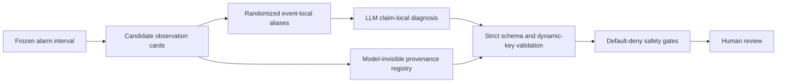

# Auditable Evidence Binding for LLM-Assisted Industrial Post-Alarm Diagnosis

This repository accompanies the manuscript:

> **Auditable Evidence Binding for Large Language Model-Assisted Post-Alarm Diagnosis in Industrial Sensor Time Series**
>
> Wu Zhang, Tianwu Lei, Luo Xiao, and Yong Yang

Industrial anomaly detectors can identify suspicious intervals, but a downstream large
language model can still produce a fluent diagnosis that cites irrelevant, stale, or
out-of-event observations. This work introduces an auditable context evidence package
that binds every candidate diagnosis to sensor-derived support, counterevidence, missing
information, event-local provenance, and deterministic safety gates.

The goal is a **rejectable interface for human review**. The package supports auditable
fault-signature diagnosis; it does not claim physical root-cause proof, field-safety
certification, or autonomous equipment control.

## Why Evidence Binding?

A valid industrial post-alarm record must satisfy several requirements that should not be
collapsed into one score:

1. **Structural validity** - the generated record follows a strict, machine-checkable
   schema.
2. **Provenance integrity** - every cited observation belongs to the current event and
   resolves to immutable source coordinates, versions, and hashes.
3. **Evidence responsiveness** - diagnoses and citations change when the underlying
   sensor content changes, rather than merely copying identifiers or positions.
4. **Semantic support** - the selected fault signature and explanation are supported by
   the cited observations.
5. **Operational safety** - uncertain, contradictory, or high-risk outputs are rejected,
   routed to data collection, or escalated to a human.

Passing an earlier layer does not imply success at a later one. In particular, schema
compliance and identifier validity are necessary audit properties, not evidence of
diagnostic correctness.

## Method Overview



For each frozen alarm event, the pipeline:

- extracts up to eight multiview candidate observation cards using global and local
  deviations, temporal features, detector contributions, process metadata, and quality
  flags;
- assigns randomized event-local aliases such as `E01` through `E08`, independent of
  candidate rank;
- retains source coordinates, dataset and extractor versions, and content hashes in a
  model-invisible provenance registry;
- asks the LLM for up to three ranked, claim-local explanations, each with supporting
  evidence, contradicting evidence, missing information, confidence, and a permitted
  action; and
- validates JSON Schema Draft 2020-12, runtime foreign keys, event ownership, hashes,
  source coordinates, and action safety outside the model.

High-risk actions such as shutdown, interlock bypass, set-point modification, or equipment
switching cannot be directly executed from generated text. Conflicting or insufficient
evidence triggers `COLLECT_MORE_DATA` or `ESCALATE_TO_HUMAN`.

## Evaluation Design

The study uses two public industrial time-series benchmarks for complementary purposes:

| Dataset | Evaluation unit | Study role |
| --- | --- | --- |
| HAI 21.03 | Attack or false-alarm cluster | Structure, provenance, counterfactual evidence tests, and held-out evaluation |
| Tennessee Eastman Process (TEP) | Independent simulation run | Known fault semantics, selective diagnosis, calibration, explanation support, and safety |

The reported retrospective HAI analysis contains 137 alarm records nested in 50
independent clusters. The primary TEP analysis contains 500 independent runs: 20 runs
from each of 20 fault classes and 100 normal runs. Repeated conditions and evaluator calls
are carried with their underlying event and do not increase the statistical sample size.

Paired controls isolate different failure modes:

- unconstrained versus schema-constrained generation;
- an information-matched summary with methods and provenance attributes removed;
- order-only permutation as a null control;
- attribute-to-identifier permutation to test whether citations follow content;
- direction reversal to test sensitivity to increase/decrease semantics;
- cross-event content replacement to test event consistency and abstention;
- provenance conflicts that must be rejected before generation; and
- deterministic identifier-copying controls that expose shortcut metrics.

## Main Reported Results

| Outcome | Full evidence | Comparison | Reported effect |
| --- | ---: | ---: | ---: |
| First-pass strict-schema compliance on HAI | 0.978 | 0.701 unconstrained | +27.7 percentage points |
| Citations following moved content | 0.776 | 0.194 retaining the original identifier | +58.2 percentage points |
| Insufficient-evidence selection or human escalation after cross-event replacement | 0.403 | 0.112 real-event evidence | +29.1 percentage points |
| TEP macro-averaged top-1 recall | 0.742 | 0.612 information-matched summary | +13.0 percentage points |
| Correct TEP label with a supported explanation | 0.714 | 0.548 information-matched summary | +16.6 percentage points |
| Potentially hazardous recommendation rate | 0.008 | 0.016 information-matched summary | -0.8 percentage points |

The complete package also achieved a TEP top-3 hit rate of 0.892 and an automated
full-support rate of 0.832. Cross-event replacement reduced top-1 recall to 0.356 and the
supported-correct-label rate to 0.244, providing a controlled check that performance
depends on event-consistent evidence.

These results test structural reliability, traceability, content responsiveness, fault
recognition, and automated explanation support separately. They do not establish physical
causality or deployment safety.

## Repository Status

This repository is being initialized for the versioned reproducibility release described in
the manuscript. At this stage, it contains the project overview only. The following
artifacts are planned but are **not yet available here**:

- executable JSON schemas and safe-record examples;
- frozen event manifests, split indices, aliases, and content hashes;
- candidate-card extraction and provenance-registry code;
- generation prompts, constrained-decoding configuration, and model metadata;
- counterfactual transformations and integrity tests;
- raw responses, validation logs, and request accounting;
- evaluator prompts, controls, and aggregated judgments; and
- bootstrap analysis scripts, environment specifications, and reproduction commands.

Release metadata, an archival identifier, access dates, and exact software and model
versions will be added with the reproducibility package. The two sealed TEP confirmation
sets described in the manuscript are not part of the reported primary results.

## Responsible Use and Limitations

- The candidate-observation extractor remains a diagnostic ceiling: irrelevant cards may
  be included and relevant mechanisms may be omitted.
- TEP is simulated, while HAI does not provide complete variable-level causal labels.
- The reported generators cover two model families and do not represent the full model
  population.
- Third-party automated assessment measures scalable semantic auditing, not agreement
  with industrial-domain experts.
- Balanced benchmark sampling does not estimate deployment prevalence or positive
  predictive value.
- Real deployment would additionally require access control, operator approval, runtime
  monitoring, incident replay, governance, and prospective expert evaluation.

Do not connect research outputs from this repository directly to industrial control
actions.

## Citation

The manuscript is currently under submission. Until final bibliographic metadata is
available, please cite it as:

```bibtex
@unpublished{zhang2026auditable,
  title  = {Auditable Evidence Binding for Large Language Model-Assisted
            Post-Alarm Diagnosis in Industrial Sensor Time Series},
  author = {Zhang, Wu and Lei, Tianwu and Xiao, Luo and Yang, Yong},
  note   = {Manuscript submitted to Sensors},
  year   = {2026}
}
```

The DOI shown in the current journal template is a placeholder and should not be used as
a persistent identifier.

## Data and Licensing

HAI 21.03 and the Tennessee Eastman Process data are public research datasets governed by
their respective providers and licenses. Dataset files will not be relicensed by this
repository.

No repository-wide software or artifact license has been published yet. Unless and until
a `LICENSE` file is added, normal copyright restrictions apply to repository contents.

## Contact

For questions about the manuscript or reproducibility package, contact the corresponding
author:

- Yong Yang - `YongYang@tiangong.edu.cn`
